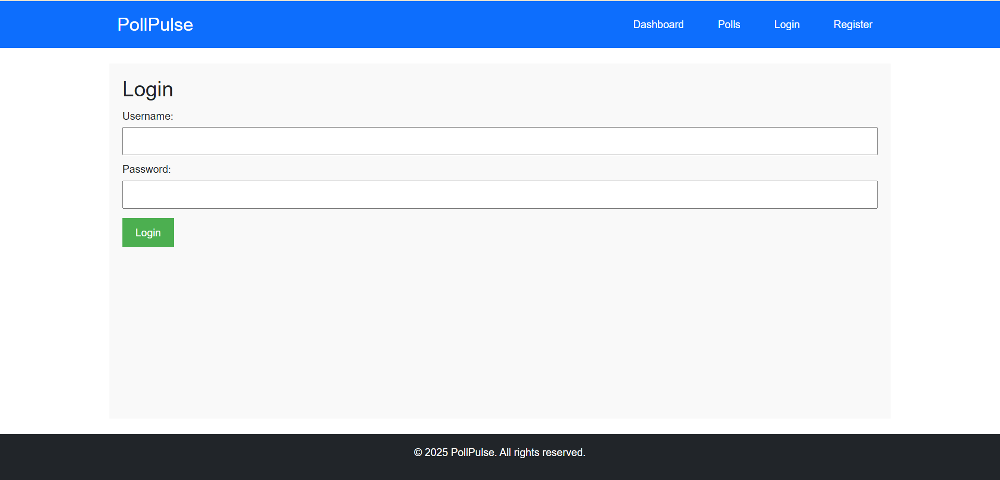
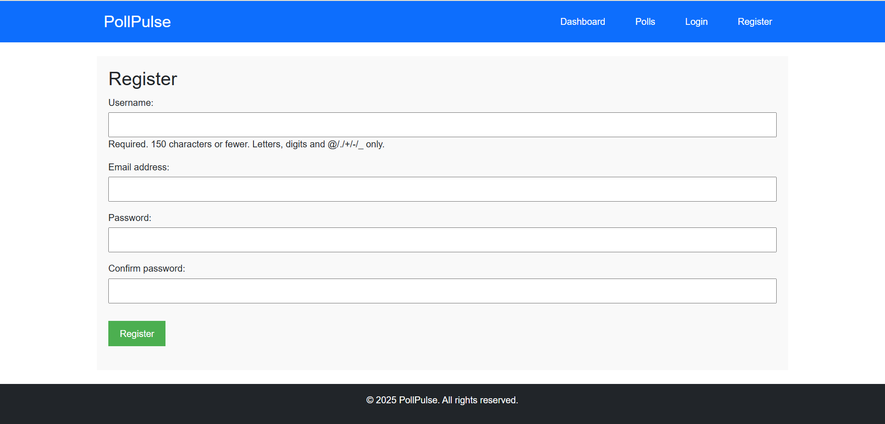
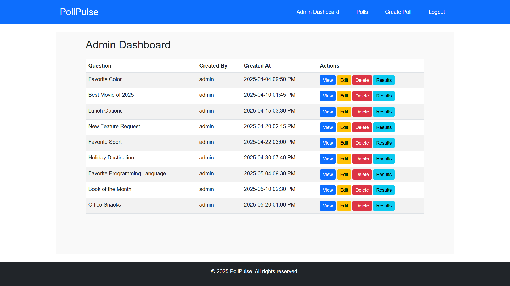
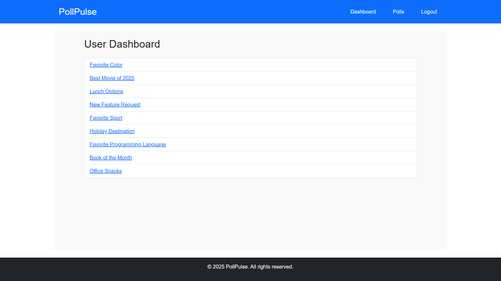
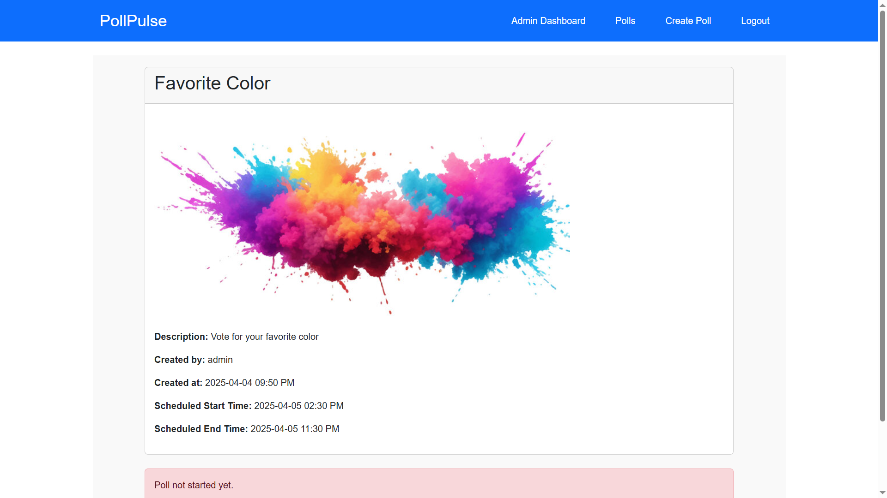

# 🗳️ PollPulse

PollPulse is an online polling system built with Django that allows users to create polls, vote, and view results in real-time. It provides secure user authentication and a separate admin dashboard to manage polls efficiently.

---

## 📚 Project Overview

**PollPulse** enables users to:
- ✅ Create and manage polls with multiple options.
- ✅ Vote on active polls and view real-time results.
- ✅ Authenticate securely (Admin/User roles).
- ✅ Access role-based dashboards.
- ✅ Schedule poll start and end times.
- ✅ Upload multimedia (images) to polls.
- ✅ View poll results dynamically with auto-refresh.

---

## 🛠️ Technologies Used

- **Frontend:** HTML, CSS, JavaScript, Bootstrap 5
- **Backend:** Django 5.1.7 (Python 3.11+)
- **Database:** MySQL

---

## 🚀 Features

### 🎯 Poll Management
- Create, update, delete, and manage polls.
- Define multiple poll options.
- Add poll start and end times.


### 👥 User Authentication
- Register, login, and logout with secure credentials.
- Role-based access:
  - Admin: Full poll management.
  - Regular Users: View and vote on polls.






### 📊 Voting & Results
- Vote on active polls.
- Prevent duplicate votes.
- View dynamic poll results in real-time.

- 
### 📅 Poll Scheduling
- Schedule polls for future start and end dates.
- Restrict voting outside poll duration.

---

## 📥 Project Setup Instructions

### 1️⃣ Clone the Repository
```bash
git clone https://github.com/vinayhp22/python-projects/tree/main/
cd pollpulse
```

### 2️⃣ Create a Virtual Environment
```bash
# For Linux/Mac
python3 -m venv venv
source venv/bin/activate

# For Windows
python -m venv venv
venv\Scripts\activate
```

### 3️⃣ Install Required Packages
```bash
pip install -r requirements.txt
```

### 4️⃣ Configure `settings.py`
- Set up your database credentials in:
```
PollPulse/settings.py
```
Update the following:
```python
DATABASES = {
    'default': {
        'ENGINE': 'django.db.backends.mysql',
        'NAME': 'pollpulse_db',
        'USER': 'root',
        'PASSWORD': 'root',
        'HOST': 'localhost',
        'PORT': '3306',
    }
}
```

### 5️⃣ Run Database Migrations
```bash
python manage.py makemigrations
python manage.py migrate
```

---

## 📄 SQL Schema Setup

To create the database and necessary tables, run the following steps:

### 1️⃣ Open MySQL Terminal
```bash
mysql -u root -p
```
Enter your MySQL password when prompted.

### 2️⃣ Run `schema.sql` File
```sql
SOURCE /path/to/schema.sql;
```
⚡ **Note:** Replace `/path/to/schema.sql` with the absolute path to your downloaded `schema.sql` file.

---

## 🔥 Run the Application

```bash
# Start the development server
python manage.py runserver
```

Open your browser and navigate to:
```
http://127.0.0.1:8000/
```

---

## 🔐 Testing Credentials

### 1. Admin User
- **Username:** admin  
- **Password:** admin  

### 2. Test User
- **Username:** testuser  
- **Password:** User@123  

---

## 📧 Contact Information

For queries or assistance, feel free to reach out:
- 📧 **Official Mail:** [vinay@skyllx.com](mailto:vinay@skyllx.com)
- 📧 **Backup Email:** [vinayhp.paramesh@gmail.com](mailto:vinayhp.paramesh@gmail.com)

---

## 🧪 Running Tests
Run tests to ensure functionality:
```bash
python manage.py test
```

---

## 📚 Folder Structure

```
PollPulse/
├── PollPulse/
│   ├── __init__.py
│   ├── asgi.py
│   ├── settings.py
│   ├── urls.py
│   └── wsgi.py
├── polls/
│   ├── admin.py
│   ├── apps.py
│   ├── forms.py
│   ├── models.py
│   ├── templates/
│   ├── urls.py
│   └── views.py
├── static/
│   └── polls/
├── media/
└── manage.py
```

---

## 📜 License
This project is licensed under the MIT License.

---