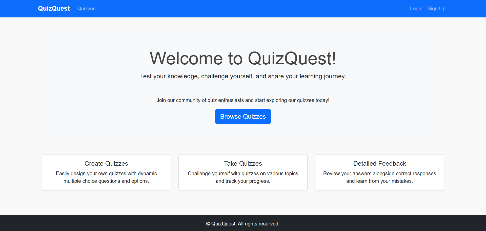

# QuizQuest

QuizQuest is an interactive web application that allows users to create, take, and share quizzes. It features secure user authentication, dynamic quiz creation with multiple choice questions (MCQs), detailed test feedback with correct answers, and score tracking. The project is built using Django for the backend, MySQL for the database, and HTML/CSS/JavaScript with Bootstrap for a modern, responsive UI.



## Project Features

- **Quiz Creation and Management:**  
  - Create quizzes dynamically with multiple MCQs and answer options.
  - Edit and delete quizzes (available to the quiz creator only).

- **Dynamic Quiz Taking:**  
  - Users provide their email and mobile number before starting a quiz.
  - Enforces one attempt per unique email/mobile combination with a cooldown period for reattempts.

- **Detailed Test Feedback:**  
  - Displays user score along with correct answers.
  - Provides a detailed breakdown for each question, showing both the user’s selected answer and the correct answer.
  
- **User Authentication:**  
  - Secure registration, login, and logout functionality using Django’s built-in authentication.

- **Modern, Responsive UI:**  
  - Built with Bootstrap 5.
  - Includes a professional header, a sticky footer, and attractive card layouts for quizzes.

## Project Structure

Below is a sample directory structure for QuizQuest:

```
QuizQuest/
├── manage.py
├── README.md
├── requirements.txt
├── schema.sql
├── QuizQuest/
│   ├── __init__.py
│   ├── settings.py
│   ├── urls.py
│   ├── wsgi.py
│   └── asgi.py
└── quiz/
    ├── __init__.py
    ├── admin.py
    ├── apps.py
    ├── forms.py
    ├── models.py
    ├── tests.py
    ├── urls.py
    ├── views.py
    ├── templatetags/
    │   ├── __init__.py
    │   └── dict_extras.py
    ├── templates/
    │   └── quiz/
    │       ├── base.html
    │       ├── quiz_list.html
    │       ├── quiz_start.html
    │       ├── quiz_detail.html
    │       ├── quiz_already_taken.html
    │       ├── quiz_create_dynamic.html
    │       ├── quiz_edit_dynamic.html
    │       ├── quiz_confirm_delete.html
    │       ├── login.html
    │       ├── signup.html
    │       └── score.html
    └── static/
        └── quiz/
            ├── css/
            │   └── style.css
            └── js/
                ├── script.js
                └── dynamic_quiz.js
```

## Project Setup

### 1. Clone the Repository

```bash
git clone <repository_url>
cd QuizQuest
```

### 2. Create a Virtual Environment and Install Dependencies

```bash
python -m venv venv
source venv/bin/activate  # On Windows: venv\Scripts\activate
pip install -r requirements.txt
```

### 3. Configure the Database

Ensure you have MySQL installed. Update the `DATABASES` configuration in `QuizQuest/settings.py` with your MySQL credentials and database name.

### 4. Run Database Migrations

```bash
python manage.py makemigrations
python manage.py migrate
```

### 5. Run schema.sql

Run the `schema.sql` file for additional database setup:

```bash
mysql -u your_mysql_user -p your_database_name < schema.sql
```

### 6. Collect Static Files

```bash
python manage.py collectstatic
```

## Running the Project

Start the Django development server:

```bash
python manage.py runserver
```

Open your browser and navigate to [http://127.0.0.1:8000/](http://127.0.0.1:8000/) to see the application.

## Testing Credentials

- **Admin:**  
  - Username: `admin`  
  - Password: `admin`

- **Test User:**  
  - Username: `testuser`  
  - Password: `User@123`

These credentials can be used to log in and test the application's features. You can also sign up for a new account via the registration page.

## Additional Information

- The project uses Django’s built-in authentication system.
- The dynamic quiz creation and editing functionalities are enhanced by custom JavaScript (located in `quiz/js/dynamic_quiz.js`).
- Custom template tags (e.g., in `quiz/templatetags/dict_extras.py`) are used for dynamic content rendering.
- The UI leverages Bootstrap 5 for a modern, responsive design including a sticky footer.

## License

This project is licensed under the [MIT License](LICENSE).

