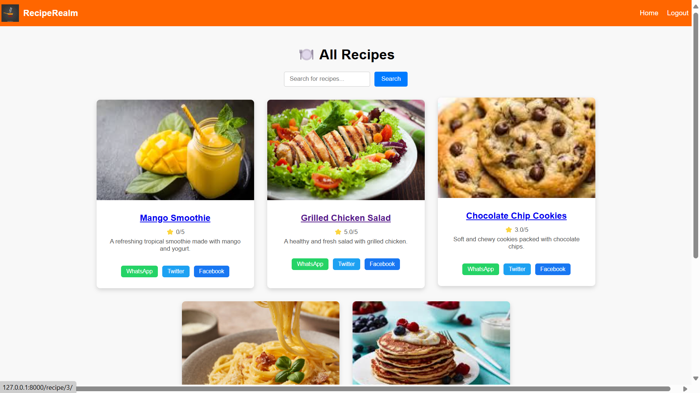
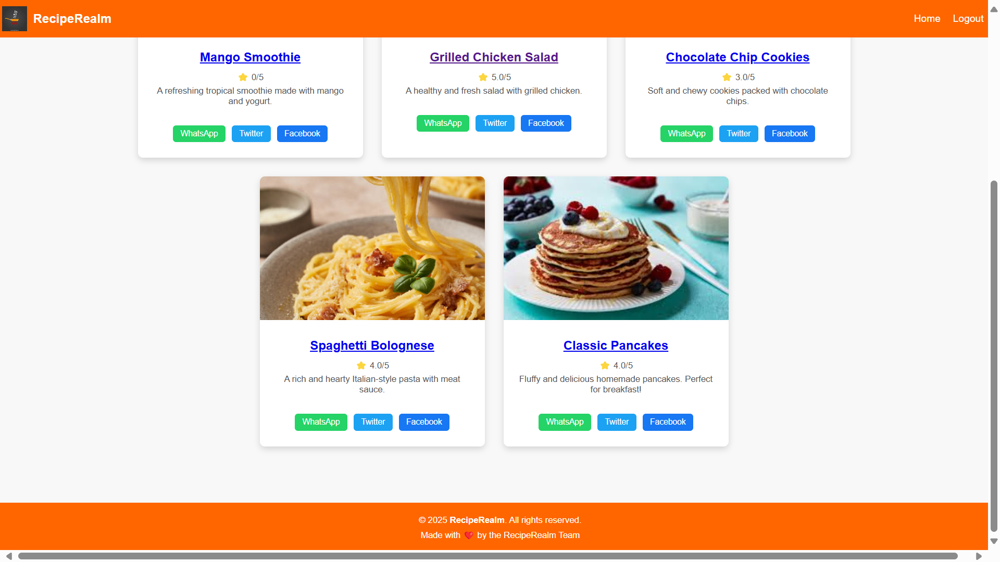

# 🍲 RecipeRealm

**RecipeRealm** is a web application built with Django that allows users to discover, create, and share their favorite recipes. Whether you're a cooking enthusiast or just learning to cook, RecipeRealm provides an easy platform to manage and explore a wide range of recipes categorized by type and rated by users.

---

## 🔍 About the Project

RecipeRealm is designed to:

- Help users **add, edit, and delete** their own recipes.
- Organize recipes into different **categories** for easier navigation.
- Provide a **search** function to find specific recipes quickly.
- Allow users to **rate recipes**, helping others discover the best ones.

---

## ✨ Features

- ➕ Add your favorite recipes
- 📝 Edit or delete existing recipes
- 📂 Categorize recipes for better filtering
- 🔎 Search recipes by name or ingredients
- ⭐ Give ratings to recipes for community feedback

---

## 🛠️ Tech Stack

- **Frontend**: HTML, CSS, JavaScript  
- **Backend**: Django (Python)  
- **Database**: MySQL  

---

## 🚀 Project Setup Instructions

1. **Clone the repository**
   ```bash
   git clone https://github.com/your-username/reciperealm.git
   cd reciperealm
   ```

2. **Create and activate a virtual environment**
   ```bash
   python -m venv env
   source env/bin/activate   # On Windows: env\Scripts\activate
   ```

3. **Install dependencies**
   ```bash
   pip install -r requirements.txt
   ```

4. **Set up the database**
   - Make sure MySQL is running.
   - Create a database named `reciperealm`.
   - Import the schema:
     ```bash
     mysql -u root -p reciperealm < schema.sql
     ```

5. **Run the Django server**
   ```bash
   python manage.py runserver
   ```

---

## 🔐 Testing Credentials

You can use the following test credentials to log in and explore:

| Username | Password   | Role       |
|----------|------------|------------|
| admin    | admin      | Admin      |
| testuser | User@123   | Registered |
| vinay    | vinay      | Registered |

---

## 📸 Screenshots

> 
> 

---

## 📄 License

This project is licensed under the MIT License. Feel free to use and modify it as per your needs.

---

## 🤝 Contributing

Pull requests are welcome! For major changes, please open an issue first to discuss what you'd like to change.

---

## 📬 Contact

For any queries or suggestions, feel free to reach out via [sahana.gn@skyllx.com] or open an issue on the repository.
