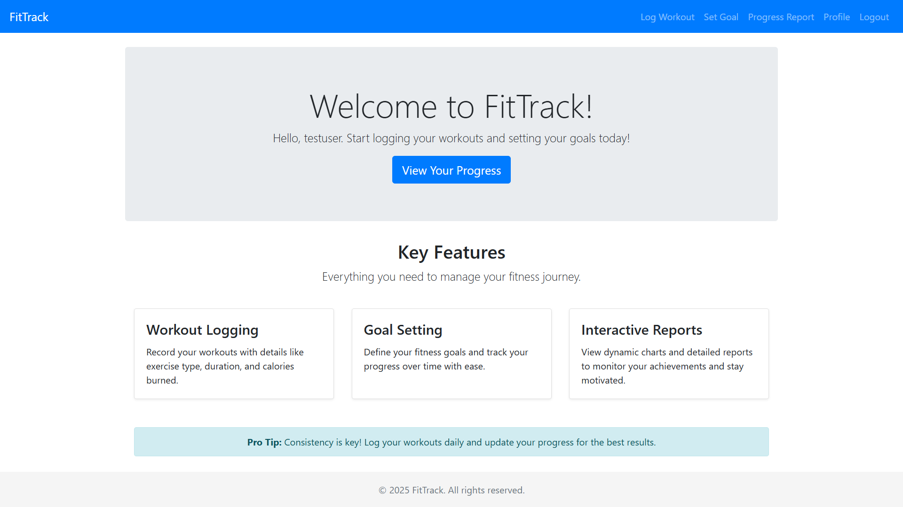
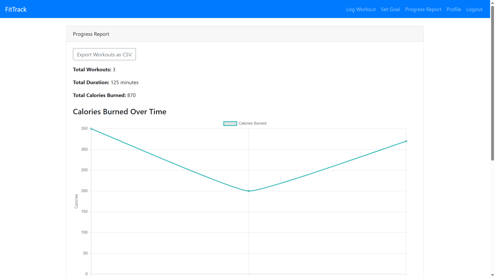
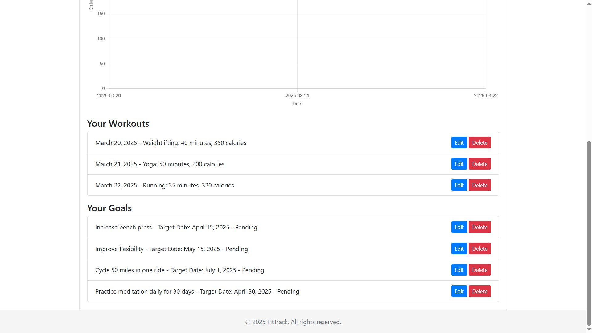

# FitTrack

FitTrack is a web-based fitness tracker that enables users to log workouts, set goals, track progress, update their profiles, and export workout data as CSV files. The project is built using Django for the backend, HTML/CSS/JavaScript for the frontend, and MySQL as the database.

---

## Project Features

- **User Authentication:** Secure registration, login, and logout using Django's built-in authentication.
- **Workout Logging:** Record workouts with details such as exercise type, duration, calories burned, and workout date.
- **Goal Setting:** Create and track fitness goals.
- **Progress Reports:** View interactive progress reports with Chart.js, including a dynamic chart for calories burned over time.
- **User Profile:** Update account details (username and email) via a dedicated profile page.
- **Data Export:** Export workout data as a CSV file.
- **Admin Panel:** Manage users and data via Django’s admin interface.

---





---

## Project Structure

```plaintext
FitTrack/
├── manage.py
├── fittrack/
│   ├── __init__.py
│   ├── settings.py
│   ├── urls.py
│   └── wsgi.py
├── tracker/
│   ├── __init__.py
│   ├── admin.py
│   ├── apps.py
│   ├── forms.py
│   ├── models.py
│   ├── tests.py
│   ├── urls.py
│   ├── views.py
│   └── templates/
│       └── tracker/
│           ├── base.html
│           ├── home.html
│           ├── login.html
│           ├── register.html
│           ├── log_workout.html
│           ├── update_workout.html
│           ├── delete_workout.html
│           ├── set_goal.html
│           ├── update_goal.html
│           ├── delete_goal.html
│           ├── progress_report.html
│           └── profile.html
├── schema.sql
└── requirements.txt
```
---

## Prerequisites

- **Python 3.x**
- **Django 3.x or higher**
- **MySQL Server**
- **MySQL client library** (e.g., `mysqlclient`)
- **Chart.js** (loaded via CDN in templates)
---

## Installation and Setup

1. **Clone the Repository:**
   ```bash
   git clone <repository_url>
   cd FitTrack
   ```

2. **Create and Activate a Virtual Environment:**
   ```bash
   python -m venv venv
   source venv/bin/activate  # On Windows: venv\Scripts\activate
   ```

3. **Install Required Packages:**
   ```bash
   pip install -r requirements.txt
   ```

4. **Configure the Database:**
   - Update the MySQL database configuration in `fittrack/settings.py` with your credentials and database name.

5. **Apply Migrations:**
   ```bash
   python manage.py makemigrations
   python manage.py migrate
   ```

6. **Load Initial Schema for Testing:**
   - Run the provided `schema.sql` to set up the basic tables and sample data for testing:
     ```bash
     mysql -u <your_mysql_user> -p <database_name> < schema.sql
     ```

7. **Create a Superuser:**
   ```bash
   python manage.py createsuperuser
   ```
---
## Running the Project

Start the Django development server:
```bash
python manage.py runserver
```
Open your browser and navigate to [http://127.0.0.1:8000/](http://127.0.0.1:8000/) to access the application.

---

## Testing Credentials

For testing purposes, use the following credentials:

- **Admin:**
  - Username: `admin`
  - Password: `admin`

- **Test User:**
  - Username: `testuser`
  - Password: `User@123`

---

## Contact
For any questions, suggestions, or issues, please feel free to contact us:

- Email: [vinay@skyllx.com](mailto:vinay@skyllx.com) || [vinayhp.paramesh@gmail.com](mailto:vinayhp.paramesh@gmail.com)
- GitHub: https://github.com/vinayhp/
---
## Additional Notes

- **Chart.js Integration:** The progress report page uses Chart.js (loaded from a CDN) to render a dynamic chart of calories burned over time.
- **Export Feature:** Users can download their workout data as a CSV file from the progress report page.
- **User Profile:** A dedicated profile page allows users to update their account information.
- **Admin Panel:** Access the Django admin panel at `/admin/` for complete management of users and data.
- This project is intended for educational and testing purposes. For production deployment, review security settings and configurations accordingly.

---

## License

This project is open-source and available under the [MIT License](LICENSE).
