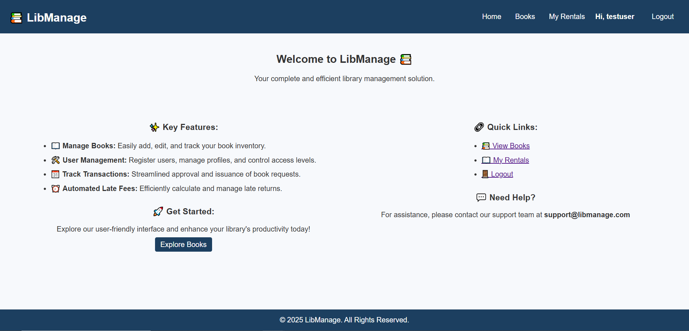
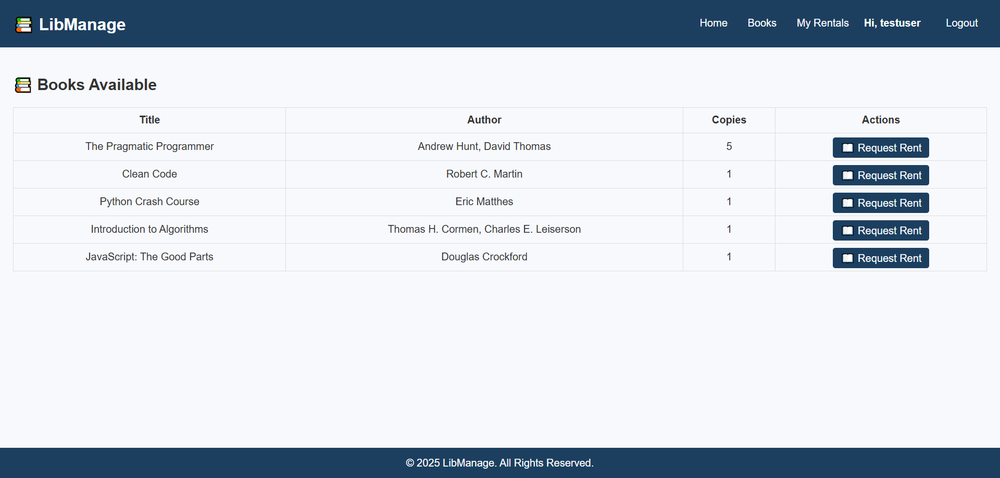
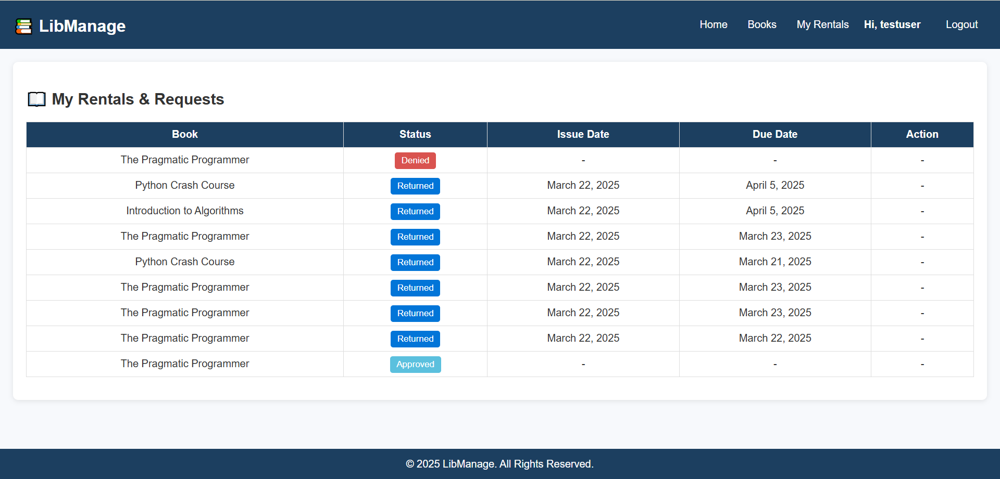

# 📚 LibManage - Library Management System

**LibManage** is a modern and user-friendly library management system built using Python and Django. It provides efficient management of book inventories, rental requests, user registrations, transactions, and early return requests.

---






---

## 🚀 Features

- **Book Management:**
  - Add, edit, delete books
  - Manage multiple copies of each book

- **User Management:**
  - User registration and login/logout
  - Admin user approval system

- **Transaction Management:**
  - Users can request to rent books
  - Admin approval workflow (Approve, Deny, Issue books)
  - Users can request early returns
  - Admin handles return confirmations

- **Late Fee Calculation:**
  - Automated calculation of late fees upon book return

- **Secure Authentication:**
  - Secure login/logout functionality with Django authentication system

---


## ⚙️ Tech Stack

- **Frontend:** HTML, CSS, JavaScript
- **Backend:** Python (Django)
- **Database:** MySQL

---

## 📂 Project Structure

```
LibManage/
├── libmanage/
│   ├── settings.py
│   └── urls.py
├── library/
│   ├── migrations/
│   ├── templates/
│   │   ├── base.html
│   │   ├── home.html
│   │   ├── library/
│   │   │   ├── book_list.html
│   │   │   ├── book_form.html
│   │   │   ├── book_confirm_delete.html
│   │   │   ├── transaction_list.html
│   │   │   ├── manage_requests.html
│   │   │   ├── manage_return_requests.html
│   │   │   └── admin_issue_book.html
│   │   └── registration/
│   │       ├── login.html
│   │       └── register.html
│   ├── static/
│   │   └── library/
│   │       └── css/
│   │           └── styles.css
│   ├── models.py
│   ├── views.py
│   ├── forms.py
│   └── urls.py
├── schema.sql
├── manage.py
└── README.md
```

---

## 🛠️ Project Setup

### Step 1: Clone the Repository

```bash
git clone https://github.com/yourusername/libmanage.git
cd libmanage
```

### Step 2: Create Virtual Environment

```bash
python -m venv env
source env/bin/activate  # On Windows: .\env\Scripts\activate
```

### Step 3: Install Dependencies

```bash
pip install -r requirements.txt
```

### Step 4: Database Configuration

- Create a MySQL database named `libmanage`.
- Update your database credentials in `libmanage/settings.py`.

```python
DATABASES = {
    'default': {
        'ENGINE': 'django.db.backends.mysql',
        'NAME': 'libmanage',
        'USER': 'your_db_user',
        'PASSWORD': 'your_db_password',
        'HOST': 'localhost',
        'PORT': '3306',
    }
}
```

### Step 5: Run Database Migrations

```bash
python manage.py makemigrations
python manage.py migrate
```

### Step 6: Load Sample Data (Optional)

Run the provided `schema.sql` file for testing purposes:

```bash
mysql -u your_db_user -p libmanage < schema.sql
```

### Step 7: Create Superuser (Admin)

```bash
python manage.py createsuperuser
```

---

## 🚦 Run Project

Start the Django development server:

```bash
python manage.py runserver
```

Visit [http://127.0.0.1:8000](http://127.0.0.1:8000)

---

## 🔑 Testing Credentials

Use these credentials for initial testing:

| Username | Password |
| -------- | -------- |
| admin    | admin    |
| testuser | User@123 |

---

## 📜 License

This project is open-source and available under the MIT License.

---

## 🤝 Contribution

Contributions, issues, and feature requests are welcome! Feel free to check [issues page](https://github.com/yourusername/libmanage/issues).

---

## 📞 Contact

Developed by Your Name - [vinay@skyllx.com](mailto:vinay@skyllx.com) || [vinayhp.paramesh@gmail.com](mailto:vinayhp.paramesh@gmail.com)

---