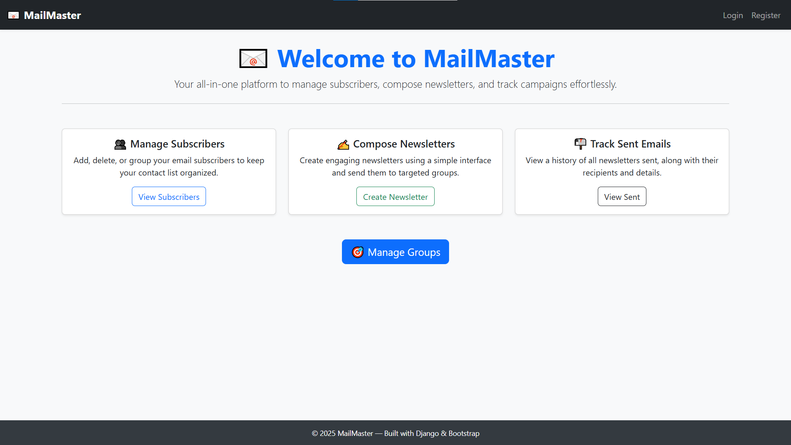
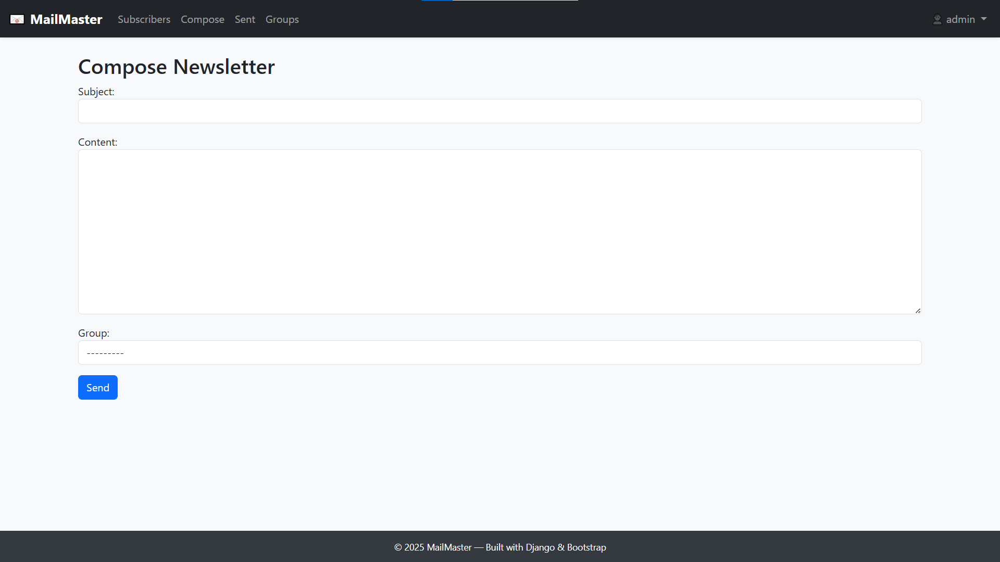
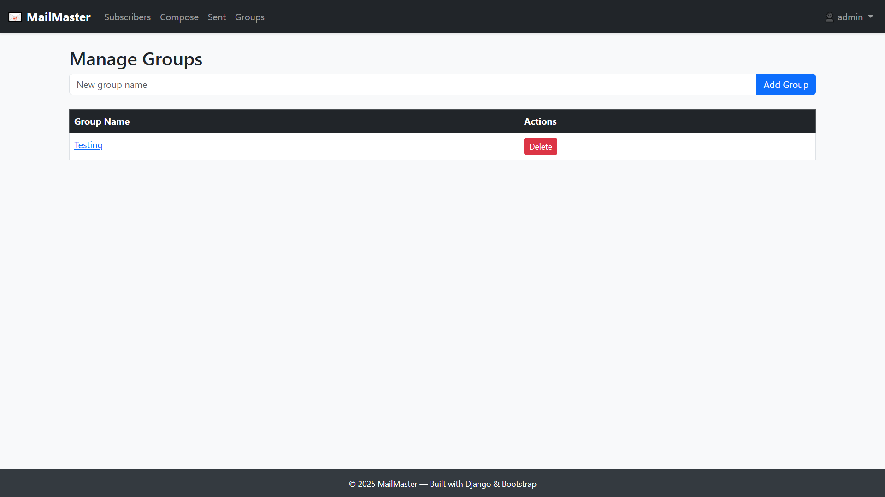
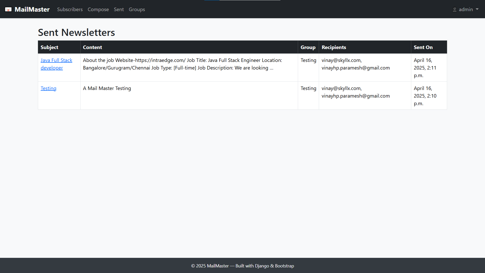
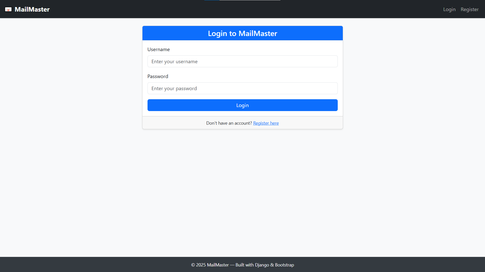
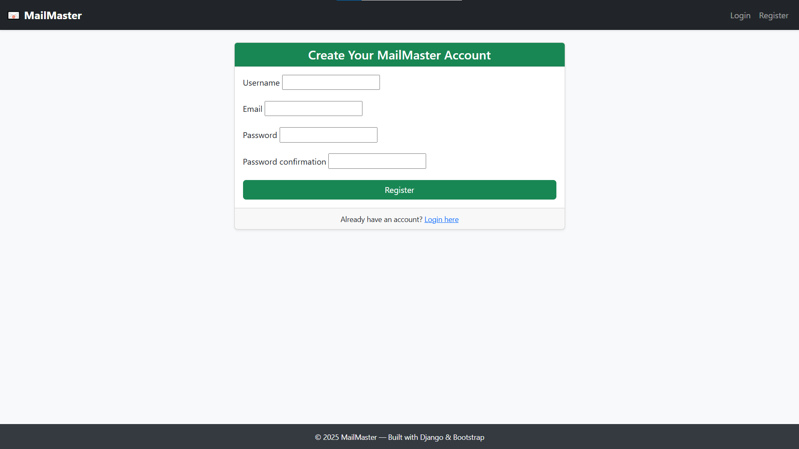

# 📧 MailMaster – Email Newsletter System

**MailMaster** is a full-stack email newsletter management system built using **Django**, **MySQL**, and **Bootstrap**. It allows users to register, create email groups, manage subscribers, compose newsletters, and track sent mails — all through a clean, responsive UI.

---

## 🚀 Features

- ✅ User authentication (Register / Login / Logout)
- ✅ Group-wise subscriber management (Add/Delete/Bulk import)
- ✅ Compose and send newsletters to targeted groups
- ✅ Track sent emails and view detailed logs
- ✅ Responsive Bootstrap UI with professional layout
- ✅ Admin and user role separation
- ✅ Favicon support, landing page, navbar, and protected views

---

## 🖼️ Screenshots
### Home Page


### Compose Newsletter


### Group Subscribers


### Sent Emails


### Login Page


### Register Page



> 💡 _All screenshots are available under the `/screenshots` folder._

---

## 🛠️ Project Setup

1. **Clone the repository**

```bash
git clone https://github.com/yourusername/mailmaster.git
cd mailmaster
```

2. **Create a virtual environment**

```bash
python -m venv venv
source venv/bin/activate  # On Windows: venv\Scripts\activate
```

3. **Install dependencies**

```bash
pip install -r requirements.txt
```

4. **Configure your MySQL database** in `mailmaster/settings.py`:

```python
DATABASES = {
    'default': {
        'ENGINE': 'django.db.backends.mysql',
        'NAME': 'mailmaster_db',
        'USER': 'your_mysql_user',
        'PASSWORD': 'your_mysql_password',
        'HOST': 'localhost',
        'PORT': '3306',
    }
}
```

5. **Apply migrations & load demo data**

```bash
python manage.py makemigrations
python manage.py migrate
mysql -u root -p mailmaster_db < schema.sql
```

6. **Run the server**

```bash
python manage.py runserver
```

---

## 👨‍💻 Demo Credentials

| Username   | Password     | Role  |
|------------|--------------|-------|
| **admin**  | admin        | Superuser |
| **testuser** | User@123   | Regular user |

---

## 📁 schema.sql

Running `schema.sql` sets up:

- Test groups (`Marketing`, `Developers`)
- Subscribers like `vinay@skyllx.com`
- Sample newsletter entries
- Test users: `admin` and `testuser`

---

## 📌 Tech Stack

- **Backend:** Django 5.1.7
- **Frontend:** HTML, CSS, Bootstrap 5
- **Database:** MySQL
- **Mail:** Django's `send_mail` utility (customizable)

---

## ❤️ Why Recruiters Love This Project

- Cleanly structured Django app (reusable apps, views, forms)
- Follows best practices (decorators, authentication, query filtering)
- Attractive, mobile-friendly UI using Bootstrap
- Shows CRUD, security, and real-world communication features
- Easy-to-run with provided `schema.sql` and demo users

---

## ✉️ How to Generate a Gmail App Password (for Sending Emails)

If you plan to send emails using Gmail, you **must use an App Password** (not your Gmail password) for security.

### 🔒 Steps to Generate a Gmail App Password:

1. **Enable 2-Step Verification** on your Gmail account:
   - Go to: [https://myaccount.google.com/security](https://myaccount.google.com/security)
   - Turn on "2-Step Verification"

2. **Generate an App Password**:
   - Visit: [https://myaccount.google.com/apppasswords](https://myaccount.google.com/apppasswords)
   - Select **"Mail"** as the app and **"Other (Custom name)"**, then name it "MailMaster"
   - Google will generate a 16-character app password. **Copy it.**

3. **Use it in `settings.py`**:

```python
EMAIL_BACKEND = 'django.core.mail.backends.smtp.EmailBackend'
EMAIL_HOST = 'smtp.gmail.com'
EMAIL_PORT = 587
EMAIL_USE_TLS = True
EMAIL_HOST_USER = 'your_email@gmail.com'
EMAIL_HOST_PASSWORD = 'your_generated_app_password'  # paste here
DEFAULT_FROM_EMAIL = EMAIL_HOST_USER
```

> ✅ Done! Your MailMaster app can now securely send emails using Gmail SMTP.

---


## 📅 Last Updated: April 16, 2025

> Made with 💙 by [Vinay @ SkyllX](mailto:vinay@skyllx.com)
