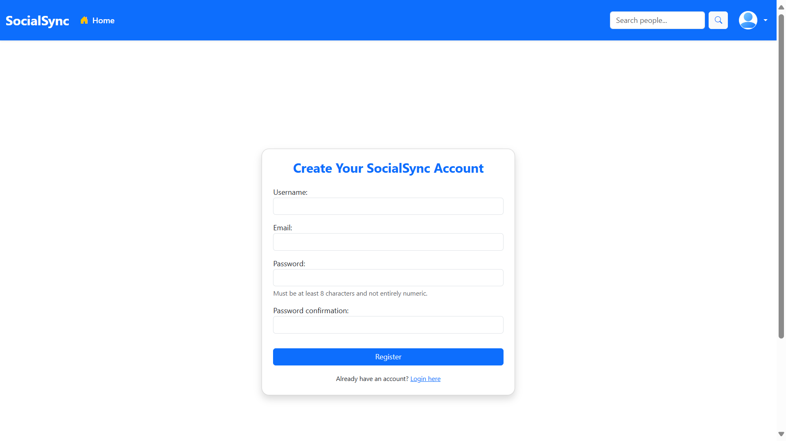
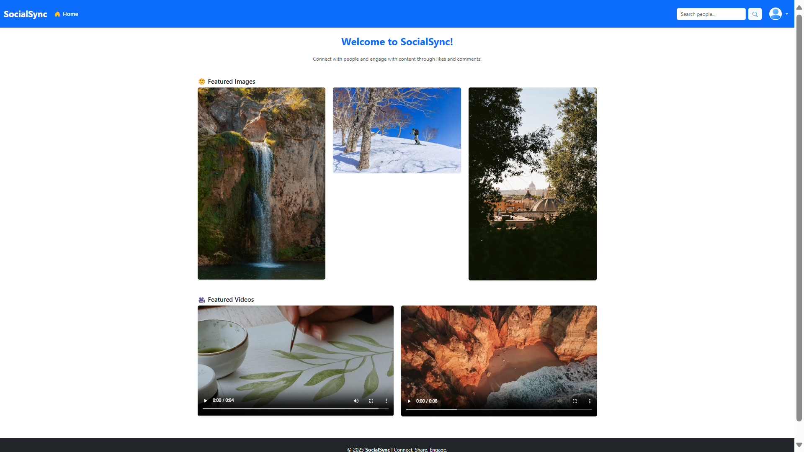
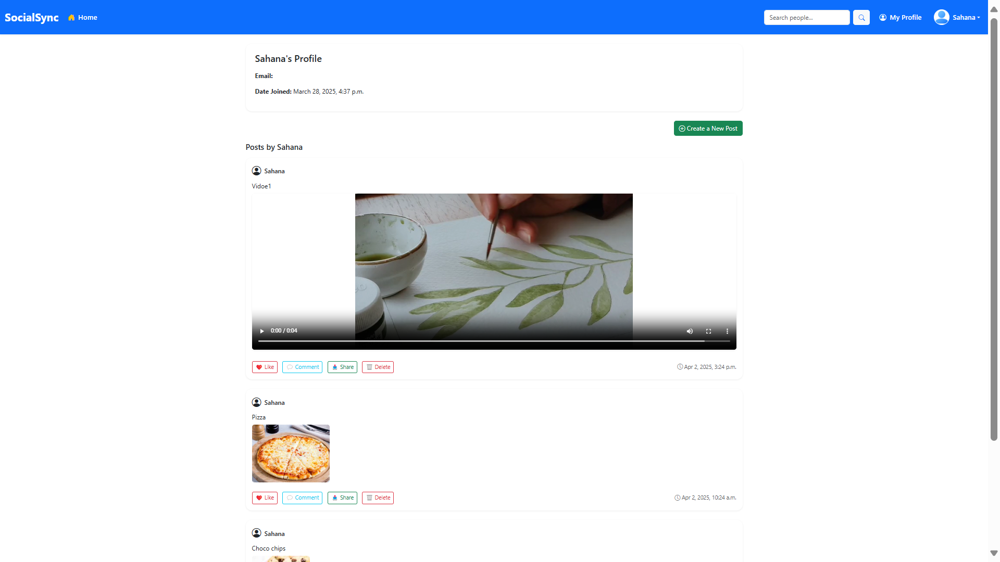
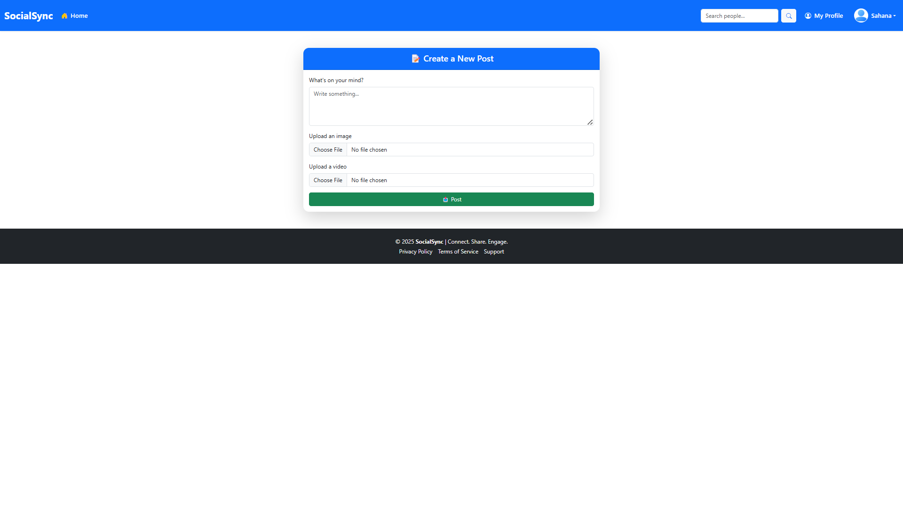
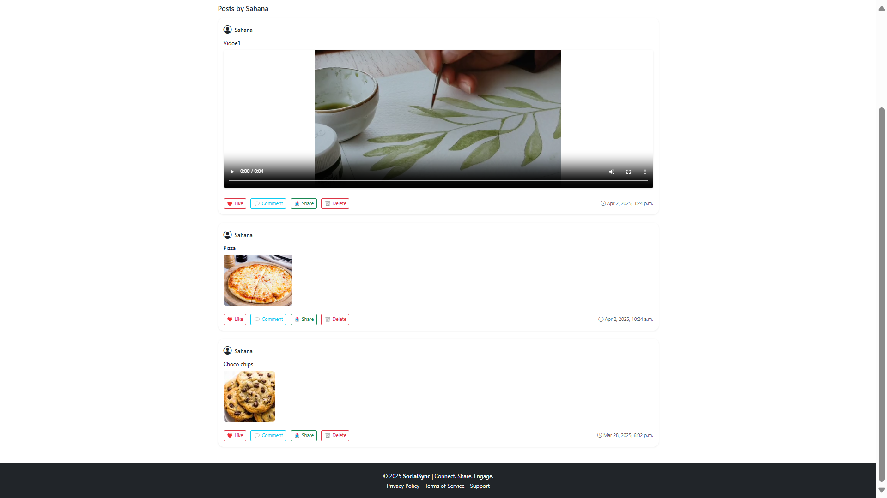
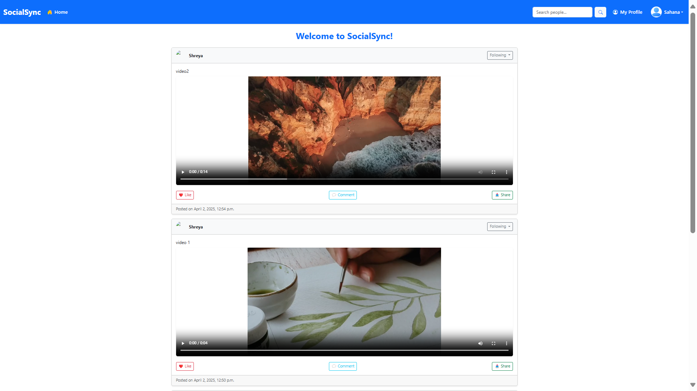

🚀 Features Implemented

✅ User Authentication

Register with username, email, password.

Login & Logout using Django's authentication system.

👤 Profile Management

View your profile with email and date joined.

Upload a profile picture (default shown if not set).

Follow / Unfollow other users from profile and post cards.

📝 Post Functionality

Create a new post with:

Text content (caption/description)

Image (JPG, PNG)

Video (MP4)

Display both image and video beautifully (if both are uploaded).

Responsive post layout for media.

📥 Feed / Home Page

View posts from users you follow.

Each post displays:

Username and profile picture

Content (text, image/video)

Like, comment, share buttons

Follow/Unfollow button for other users

Delete option for own posts only

❤️ Engagement

Like a post (toggle style).

Comment on a post (opens comment view).

Share link to post user's profile (copied to clipboard).

🔍 Search Users

Search by username using the navbar search box.

Shows matching profiles with quick access links.

🧾 Create Post Page

Styled post form with Bootstrap.

multipart/form-data support for media uploads.

🗑️ Post Management

Post owners can delete their posts using the red trash icon.

💅 Styling

Bootstrap-based design.

Icons using Bootstrap Icons (CDN).

Modern card layouts, rounded buttons, shadows, and responsive design.

⚙️ Tech Stack

Backend: Django 5.1

Frontend: Bootstrap 5 + HTML templates

Database: MySQL Workbench

📂 Folder Structure (Important Files)

socialsync/
├── core/
│   ├── models.py
│   ├── views.py
│   ├── forms.py
│   ├── urls.py
├── templates/
│   ├── base.html
│   ├── registration/
│   │   ├── login.html
│   │   ├── register.html
│   │   ├── create_post.html
│   │   ├── profile.html
│   │   ├── home.html
├── static/
│   ├── images/
│   └── videos/

🖼️ Screenshots

(You can add your screenshots below each section in the actual README file)

Register / Login Pages

Home Feed

Profile View

Create Post

Post with Image

Post with Video

Follow/Unfollow Buttons

✅ Setup Instructions

Clone the project

Create a virtual environment

Install dependencies with pip install -r requirements.txt

Run migrations: python manage.py migrate

Start server: python manage.py runserver

Open http://127.0.0.1:8000 in your browser